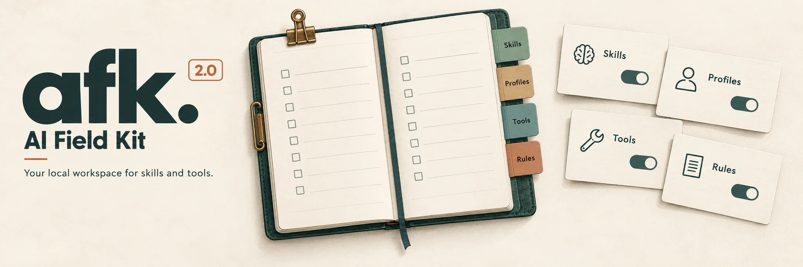

# AI Field Kit — AFK 2.0

> **Welcome to AFK 2.0.** This is the new, focused AFK. Want the previous setup,
> catalog, layered rules, hooks, or custom-agent behavior? Install a version before 2.0,
> or fork its tagged source from the [pre-2.0 releases](https://github.com/logbookfordevs/ai-field-kit/releases).

AFK is a local web workspace for the skills and tools you use with coding agents.
Keep reusable skill profiles ready, enable them globally or for a project, and
read a whole profile on demand without enabling it.

AFK 2.0 is released. Unreleased changes in this checkout are listed under
**Next Release** in the [changelog](CHANGELOG.md).

## Run the local build

Requires Node.js 20 or newer and the repository's configured pnpm version.

```sh
pnpm install
pnpm afk:build
node packages/afk/dist/index.js
```

AFK opens a browser on a loopback address. Use **Exit AFK** in the header or
Ctrl+C in the terminal to stop it. Exiting preserves your configuration and
skill activation.

## What you can manage

| Section | Purpose | Scope |
| --- | --- | --- |
| Profiles | Prepare selected skills once, enable a group, or read its instructions | Shared definitions; activation per target |
| Installed Skills | Inspect and update local files, filter skills, manage availability and invocation, delete stored copies | Global or a selected project |
| Sources & Stacks | Save repository bookmarks or multi-source selections, copy commands or run installation | Shared definitions; installation targets Global or a project |
| Tools | Save and explicitly run install/update commands | Always global |
| Agent rules | Edit shared rules and references, preview and sync managed regions | Shared document; explicit destination files |
| Settings | Choose the AFK folder, import/export, define project folders | One configuration |

Profiles prepare repository skills through Skills CLI in a private temporary
workspace. Newly selected copies stay disabled under your home agents directory.
Activation creates links in the selected discovery paths; disabling removes only
AFK-owned exposure. Existing files and skills needed by another profile are preserved.

**Use with your agent** shows instructions and a copyable command. AFK prints
the group's instructions for the calling agent to read; it does not inject another
chat or register a slash command.

Sources and stacks offer copied commands or explicit Install actions with progress.
Installed Skills updates preserve availability and invocation preferences; its
Profile filter also scopes the automatic discovery token estimate. Source cards
can create a profile draft without removing the bookmark. Tools run saved commands
only when you choose Install or Update, individually or in a reviewed batch.
Removing a tool entry does not uninstall it.

Stack publishers can use the [versioned manifest contract](docs/skill-stacks.md) and
[example](docs/examples/skill-stack.v1.json). Import pasted JSON or a direct HTTPS
manifest URL, review it, then copy its sequential Skills CLI script or install
through the app.

## Manage AFK through your agent

The [afk-cli skill](skills/afk-cli/SKILL.md) gives agents the same management
capabilities as the app. It ships with AFK: run `afk guide` and have your agent read
the returned `SKILL.md` path. A separate skill installation is optional.
Edit simple definitions with schema guidance, run
`afk doctor --json` to check local consistency, and use headless AFK operations
for changes to skill files, activation links, and managed rule regions.
The [agent guide](docs/agents.md) explains installation and workflows.

## Documentation

- [App guide and CLI reference](packages/afk/README.md)
- [Managing AFK with an agent](docs/agents.md)
- [Settings, storage, and import/export](docs/settings.md)
- [Agent rules and conflict handling](docs/specs/agent-rules.md)
- [Development and verification](docs/development.md)
- [Product specification](docs/specs/afk-pivot.md)
- [Domain glossary](CONTEXT.md)
- [Changelog](CHANGELOG.md)

AFK no longer manages catalogs, conditional rule layers, hooks, MCP configuration, custom agents,
setup presets, or general agent-environment provisioning. Existing user files are not
automatically migrated or removed. Historical releases remain documented in the
changelog and Git history.

## Repository

- `packages/afk/src/fieldwork/`: CLI, settings, local APIs, skill preparation and activation.
- `packages/afk/web/`: local app and its scoped design system.
- `skills/afk-cli/`: agent management workflow and on-demand references.
- `docs/`: current guides, decisions, specifications, and approved design references.
- `apps/site/`: public website and documentation.
- `scripts/`: build, installation, and release support.

The live website is [ai-field-kit.logbookfordevs.com](https://ai-field-kit.logbookfordevs.com/).

AFK is a tool from [Logbook for Devs](https://logbookfordevs.com/).

## Update skills

Use **Update skills** in Installed Skills, or `afk skills update -g` /
`afk skills update -p <project>`, to update tracked skills while preserving
availability and AFK invocation preferences.

## Update AFK itself

Run `afk update` to rerun the hosted release installer and install the latest AFK
release. `afk update --dry-run` prints the command without running it. This is
separate from updating installed skills and works without reading AFK settings.

## Run in the background

```sh
afk --background
afk status
afk restart
afk stop
```

Background start prints the local URL without opening a browser. Status shows the
URL, process ID, resident memory (RSS) and log location. Stop gracefully closes the background instance;
foreground sessions are independent. Runtime records and logs stay under `~/.afk/`,
separate from your portable settings. Starting again reuses the running instance.
`afk ui --background` is also accepted. **Exit AFK** can close a background server
from the app; closing the browser tab leaves it running. Background instances use
the settings selected when they start. `afk restart` uses the running server’s
current port and settings path, even if your terminal’s `AFK_SETTINGS` changed.
If no background instance is running, it suggests `afk --background`. Foreground
sessions are untouched. To switch via `AFK_SETTINGS`, stop and start explicitly.

### Choose a fixed port

```sh
afk --port 4310
afk --background --port 4310
```

With `--port`, the app uses `http://127.0.0.1:4310`. Without it, AFK picks an
available port. Ports must be integers from 1 to 65535; an occupied port causes
an error rather than a fallback. Browser-blocked ports such as 6666 are rejected
before starting; choose a web port such as 4310 or 8080. If the background instance already uses another
port, run `afk stop` before restarting with your chosen port. The port is a launch
option, not a saved setting. `afk ui` accepts the same options.

`afk status` reports the server’s current resident RAM in MiB, including Node.js
and native allocations. It excludes the browser tab and child tool processes.
Older running servers show memory as unavailable until restarted after updating.
`afk restart` is included in the next release; use a source build until published.
